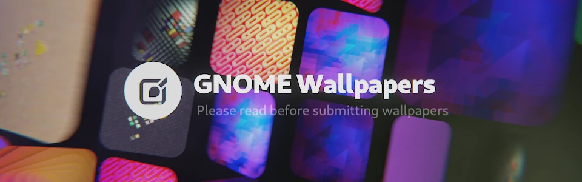
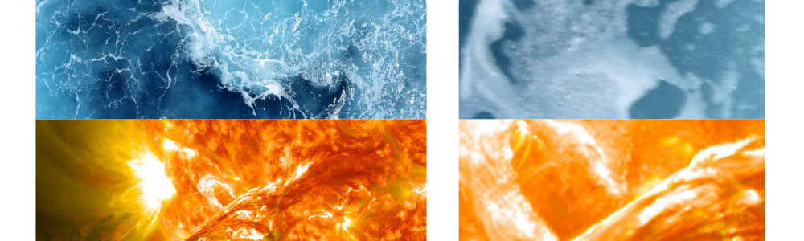

# GNOME Backgrounds

This module contains a set of backgrounds packaged with the GNOME desktop.

## Design Guidelines

### Default

The default wallpaper has historically been strictly abstract, low contrast. The geometric pattern has oscillated around stripes and triangles and over the years has become part of the GNOME brand. Steering too much away from it will dilute the brand. 

### Supplemental

It is desirable to have a wide mix of themes and colors for the additional wallpapers. Photographs and illustrations that would otherwise be too contrasty and with high frequency detail to be a good backdrop are perfectly suitable. Starting with GNOME 42, each wallpaper should come in two variants, light and dark. While the actual difference isn't well defined, the dark variant should try to limit the overall brightness.

#### Cultural Considerations

GNOME is deployed globally. Be aware of some bad connotations in certain geographical areas. Depictions of some animals, flags or body parts are better avoided.

#### Technical Constraints

GNOME Human Interface Guidelines povide some [background on size and aspect ratio](https://developer.gnome.org/hig/reference/backgrounds.html) for the wallpapers.

##### File size

Unfortunately due to distribution limits, the background collection has to keep its size contrained to around 40MB. This forces us to replace assets rather than add them. You can download the [Nostalgia](https://flathub.org/apps/details/im.bernard.Nostalgia) app to view previous release wallpapers.

One wallpaper is reserved for plain color to be used for remote access where it's beneficial for the compression algorithm to cope with it with ease. 

##### Sharpness

Many photographic sources look great as a thumbnail or scaled down, but at 1:1 aren't 100% sharp. While it may not present itself as a problem on an average laptop screen, the wallpaper has to work on super wide screens where it's cropped to fit and is presented at 1:1 or even scaled up in some cases. Many otherwise suitable background images just fall short when observed at the nominal pixel view. Chromatic aberation and noise is also something that becomes apparent as you approach 1:1.

##### Color Banding

Images should look decent even on lower quality displays. Techniques such as dithering should be used for elements with low contrast areas that would otherwise be prone for color banding.

## Background "source"
To easily create derivative works, the [wallpaper-assets repo](https://gitlab.gnome.org/Teams/Design/wallpaper-assets) contains most of the abstract wallpapers as Blender project files.

## License

CCBYSA / Public Domain / CC0 is preferred. Authorship does need to be sourced, all attribution goes to the AUTHORS file.
