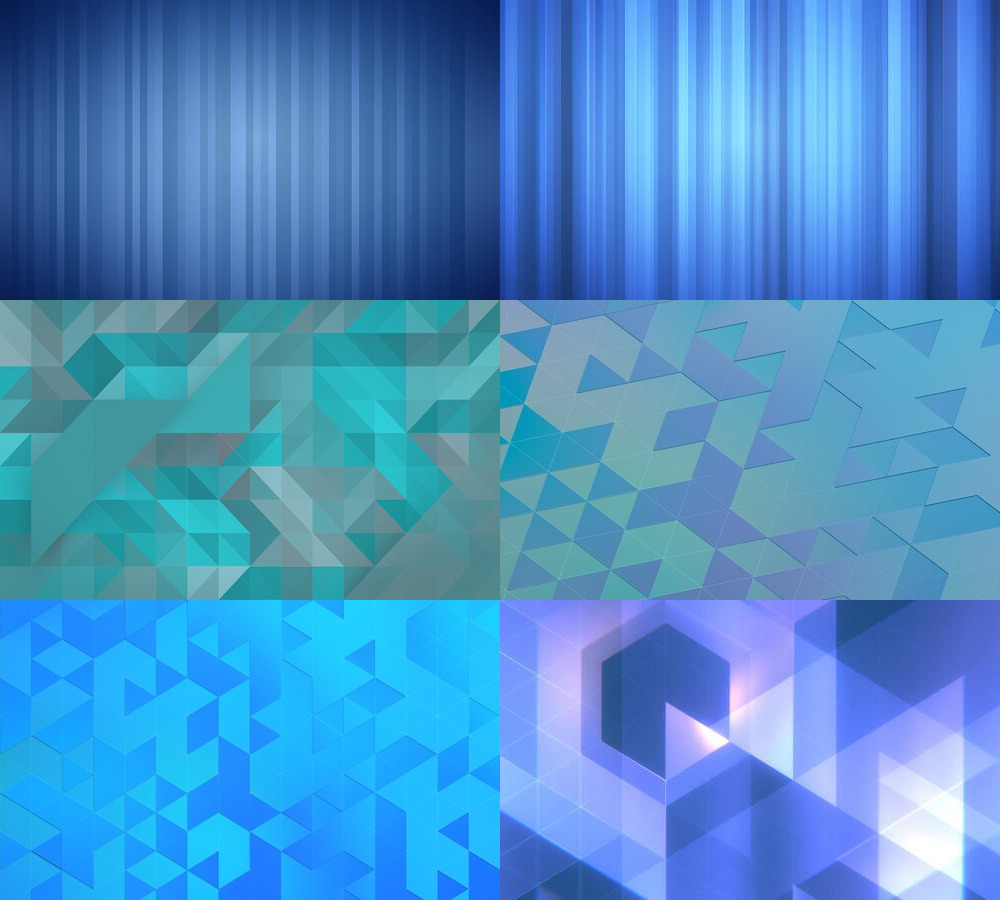

# GNOME Backgrounds

This module contains a set of backgrounds packaged with the GNOME desktop.

## Design Guidelines

### Default

The default wallpaper has historically been strictly abstract, low contrast and provided in three daytime variants. The geometric pattern has oscillated around stripes and triangles and over the years has become part of the GNOME brand. Steering too much away from it will dillute the brand.

### Supplemental

It is desirable to have a wide mix of themes and colors for the additional wallpapers. Photographs and illustrations that would otherwise be too contrasty and with high frequency detail to be a good backdrop are perfectly suitable. Photos should generally be at least 3840x2160px, with no artifacts such as chromatic aberation. Generally 16:9 aspect ratio is preferred as the wallpapers get scaled with the `background-size: cover` equivalent method and wide displays are becoming more and more common.

### Low Fidelity and Size Constraints

One wallpaper is reserved for plain color to be used for remote access where it's benefitial for the compression algorith to cope with it with ease. Unfortunately due to distribution limits, the background collection has to keep its size contrained to around 40MB. This forces us to replace assets rather than add them. You can download the [Nostalgia](https://flathub.org/apps/details/im.bernard.Nostalgia) app to view previous release wallpapers.

## License

CCBYSA / Public Domain / CC0 is preferred. All attribution goes to the AUTHORS file.
